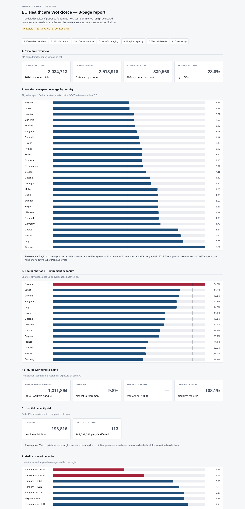
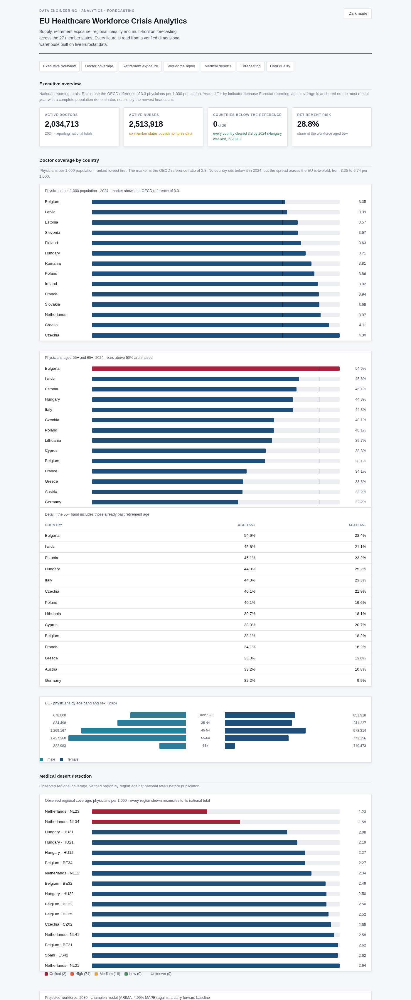
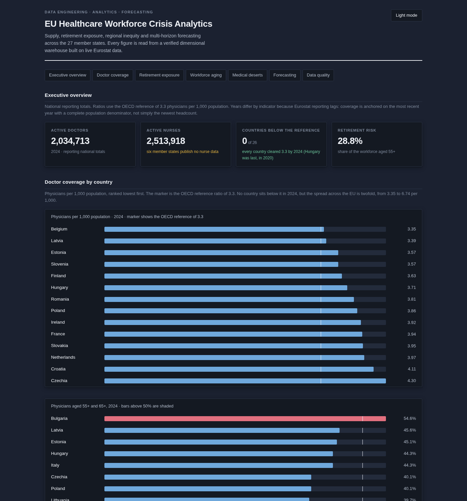
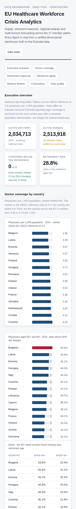
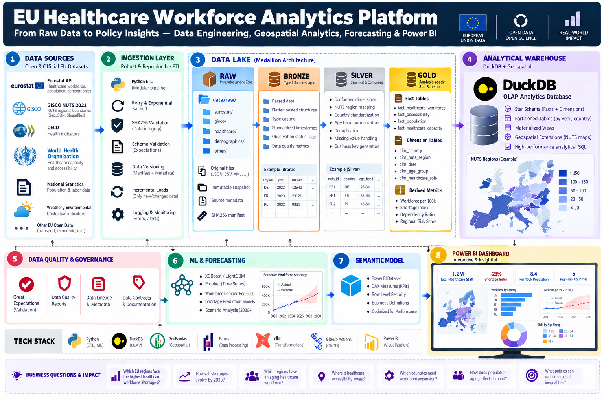

<h1 align="center">
  
  <br>EU Healthcare Workforce Crisis Analytics &amp; Forecasting Platform
</h1>

<p align="center"><em>A medallion data platform for the European health-workforce shortage — live Eurostat ingestion, a dimensional warehouse, a data-quality framework, and a seven-model forecast comparison.</em></p>

<p align="center">
  <a href="docs/PLAN.md">Plan</a> ·
  <a href="docs/FINDINGS.md">Findings</a> ·
  <a href="docs/FORECASTING.md">Forecasting</a> ·
  <a href="docs/REGIONAL.md">Regional</a> ·
  <a href="docs/POWERBI.md">Power BI</a> ·
  <a href="docs/DEPLOY.md">Deploy</a>
</p>

Everything here runs against **live public data**. No synthetic or mocked figures appear in any result.

```bash
make setup      # create the environment
make all        # full pipeline, in order, then lint + tests
```

Or step by step:

```bash
make ingest     # pull Eurostat into the raw landing zone  (~4 min cold)
make geo        # install NUTS 2021 boundaries for map visuals
make warehouse  # quality gate + star schema into DuckDB
make regional   # observed NUTS-level workforce, level-harmonised
make forecast   # 7 model families, walk-forward validated
make views      # build all 22 semantic views (fails loudly if any is broken)
make test       # 299 tests
```

**To load into Power BI:** connect to `data/healthcare_dw.duckdb`, or publish
Parquet exports. Full instructions in [`docs/POWERBI.md`](docs/POWERBI.md).

## Power BI

The dashboard is a **Power BI Project** in [`powerbi/pbip/`](powerbi/pbip/) —
not a `.pbix`, which cannot be written from a command line, and not a
specification. Open it in Power BI Desktop and it is a working report: 44 DAX
measures, 30 relationships, 8 pages, 63 visuals, live DuckDB source.

```bash
make pbip          # regenerate from the warehouse
# Power BI Desktop: File → Open → powerbi/pbip/EU-Health-Workforce.pbip
```



The image above is a **preview rendered from the same warehouse tables and the
same measures the Power BI model binds to** — not a Power BI screenshot, which
cannot be captured on Linux. That distinction is stated on the artefact itself.

## Dashboard

A static dashboard generated from the warehouse by `make site`. Every figure
below is a real capture of the rendered page — no mockups.



**Coverage** — physicians per 1,000 population by country, ranked lowest, with
the OECD reference ratio marked. **Retirement exposure** — share of physicians
aged 55+, shaded above 50%. **Age pyramid** — physician age distribution by sex
for Germany, showing the width of the retirement pipeline against entrants.
**Medical deserts** — observed regional coverage, every region reconciled to its
national total before publication.

Dark mode and mobile are supported and are checked in CI-grade detail:

| Dark mode | Mobile (390px) |
|---|---|
|  |  |

The page carries its own caveat block, which is the part that keeps it honest:
six countries with no nurse data, 12 verified regional countries ending ~2015,
and the finding that every tree-based model lost to the naive baseline.

Deploy it as static files — no build step, no server. GitHub Pages works via the
included workflow; Cloudflare Pages via `wrangler pages deploy site`.

**Where each artefact goes:** the dashboard to Cloudflare Pages or GitHub
Pages; the PBIP to Power BI Service (Cloudflare cannot execute DAX); the 9 MB
DuckDB warehouse to object storage with a scheduled refresh. Full breakdown,
including a Power BI pipeline for CI-driven publication, in
[`docs/DEPLOY.md`](docs/DEPLOY.md).

## What the data actually says

| Question | Answer (live Eurostat, 2020 unless noted) |
|---|---|
| Largest physician shortages | Hungary 3.16 / 1,000 — the only EU27 state below the 3.3 OECD reference. Belgium 3.22, Slovenia 3.31 |
| Greatest retirement exposure | Italy: **56.2%** of physicians aged 55+, 23.0% aged 65+. Bulgaria 53.0%, Latvia 47.6% |
| Improving or worsening | Germany rose 4.20 → 4.67 physicians per 1,000 (2016–2023), positive every year |
| Gender composition | Nurses 84–86% female in Germany, Spain, Belgium, Austria |
| ICU intensity | Hungary 6.18% of hospital beds, Luxembourg 5.28%, Belgium 3.31% |
| Best forecast model | **ARIMA, 4.99% MAPE** — beating naive (5.50), Prophet (5.74), drift (6.16) and every tree model |

Full detail: [`docs/FINDINGS.md`](docs/FINDINGS.md),
[`docs/FORECASTING.md`](docs/FORECASTING.md), [`docs/REGIONAL.md`](docs/REGIONAL.md).

## Architecture



```text
Sources (Eurostat, GISCO NUTS 2021)
   |  retry, backoff, sha256 manifest, byte-exact capture
   v
RAW          data/raw/<source>/           immutable landing zone
   |  parse, flatten, type-cast, attach observation status flags
   v
BRONZE       typed, source-shaped
   |  conform dimensions, map codes, dedupe, reconcile
   v
SILVER       canonical age bands, business keys
   |  join dimensions, derive ratios, assign risk tiers
   v
GOLD         star schema, analysis-ready
   v
DuckDB       data/healthcare_dw.duckdb
   v
SERVING      SQL views, ML forecasts, GIS
```

Layer contract: **raw** never transforms · **bronze** never cross-joins ·
**silver** never presents aggregates · **gold** holds no raw codes.

### Live data snapshots

Animated SVG charts generated from the warehouse (`scripts/build_readme_charts.py`). Values are real.

**Germany physicians per 1,000 (2014–2024)**



**Retirement exposure — share of physicians aged 55+ (most recent year)**



**Forecast model comparison — MAPE % (lower is better)**



## Warehouse

Seven conformed dimensions and eight facts, each with a **declared grain**
recorded next to the code that builds it:

| Fact | Grain |
|---|---|
| `fact_healthcare_workers` | profession × age group × sex × country × year |
| `fact_retirement` | profession × age band × country × year |
| `fact_population` | country × sex × year |
| `fact_population_nuts` | NUTS region × age group × sex × year |
| `fact_hospital_capacity` | country × year × bed category |
| `fact_staffing_shortage` | profession × country × year |
| `fact_regional_workforce` | NUTS region × profession × year (observed, verified) |

`dim_country` and `dim_region` are SCD Type 2; the rest are immutable.

## The three bugs that shaped this project

Each produced output that looked successful while being wrong. Each is now a
regression test.

**1. The flattener decoded the wrong index format.** Eurostat returns *flat
row-major* integer keys (`"0"`, `"3"`, `"60"`), not comma-separated tuples. Every
key raised `ValueError` and was swallowed by a bare `except`, so the loader
returned zero rows from every dataset — while logging `OK`. 54 payload files
contained no observations at all.

**2. Countries report at different NUTS levels.** `hlth_rs_prsrg` mixes NUTS 1,
2 and 3 in one `geo` column. Summing it **double counts France by 91.6%** and
**Poland by 25.3%**. Germany, Italy and Spain reconcile exactly, which is why it
is easy to miss. Resolved by assigning every code its level from the official
GISCO NUTS 2021 classification and detecting each country's real reporting level
by reconciling against the national total.

**3. Lags were computed across countries, not time.** `shift()` defaults to
`axis=0`. Germany's `lag_1` was another country's headcount, and no forecast
model worked until it was fixed.

## Data quality

Every layer is gated. `quality/dq.py` runs seven check families — completeness,
uniqueness, validity, referential integrity, consistency, freshness, coverage —
and produces a 0–100 score per table. Current scores: **physicians 88.9**,
**nurses 77.8**.

Findings encoded as checks rather than comments:

- **Six member states publish no nurse data at all** (BG, CY, LU, PL, PT, SE).
- **Missing is not zero.** Germany reports hospital beds through 2019 and
  nothing after; a naive join renders "0 hospital beds", which reads as *Germany
  closed every hospitals*. `v_coverage_index_safe` returns NULL and a flag.
- **Only 43% of country-years** report a full age breakdown.
- **Eurostat's TOTAL is not always the sum of its own age bands** (≤0.53%
  residual on complete rows), so reconciliation allows 1% tolerance.

## Known limitations

Stated up front rather than buried.

1. **Regional data is thin and partly unusable.** `hlth_rs_prsrg` is
   discontinued (4,063 values in 2014 → 54 in 2021) and keyed by occupation, not
   age or sex. After level harmonisation and reconciliation only 12 countries
   and 2,240 verified rows remain, 100% reconciled; 54% of physician and 12% of nurse
   country-years reconcile between the two Eurostat tables. Regional rates are
   indicative rather than same-year, because the denominator is a 2023 snapshot.
2. **Power BI screenshots cannot be captured on this host.** Power BI Desktop is
   Windows-only. What exists instead is `powerbi/pbip/` — a **Power BI Project**
   that Desktop opens directly (44 measures, 30 relationships, 8 pages, 63
   visuals) — plus a rendered preview computed from the same tables and
   measures. Opening the PBIP in Desktop is the only step between this repo and
   an authoritative screenshot.
3. **EURES has no public API**, so `fact_job_vacancies` is built from labour
   market, training-origin and graduation proxies, flagged `data_basis`.
4. **OECD SDMX and several national portals were unreachable** from the build
   host (timeout / 401). Eurostat equivalents are used instead.
5. **National portal coverage is NL + DE**, not 13 countries.
6. **Forward regional projections to 2030+ still need an explicit allocation
   assumption.** Observed regional supply effectively ends ~2015.

## Layout

```text
src/ingestion/   http client, JSON-stat decoder, verified dataset registry
src/transform/   age-band reconciliation
src/warehouse/   dimensions, facts, DuckDB build CLI
src/quality/     data quality framework
src/ml/          7 forecast models, walk-forward evaluation
src/geo/         NUTS level harmonisation, regional CLI
src/dashboard/   warehouse -> JSON export for the static site
src/powerbi/     PBIP generator (semantic model + 8-page report)
sql/             22 semantic views (analytics, integrity, Power BI measures)
powerbi/         DAX measure library + generated PBIP project
site/            static dashboard and PBIP preview (generated)
scripts/         ingest, views, geography, site build, screenshots
docs/            plan, findings, forecasting, regional, PowerBI, deploy
tests/           299 tests
```

`src/ingestion/registry.py` records every dataset's verified dimensions, plus a
`NON_EXISTENT_CODES` tuple listing seven dataset codes that were referenced in
the original codebase **but do not exist in the Eurostat catalogue**, so they are
never reintroduced.

## Requirements

Python 3.11–3.12. Core dependencies only for ingestion and the warehouse;
`pip install -e ".[ml,viz,dev]"` for forecasting and GIS.